# Partner Onboarding Workflow

```mermaid
flowchart LR
    Start([Start]) --> Form[Fill Out<br/>Request Form]
    Form --> Input1[Select Type:<br/>Partner/Resource/Project]
    Input1 --> Input2[Enter Details &<br/>SME Requirement]
    Input2 --> Generate[Generate<br/>Checklist]

    Generate --> Template[(Template)]
    Template --> Decision{Type?}

    Decision -->|Partner| PC[Partner<br/>Checklist]
    Decision -->|Resource| RC[Resource<br/>Checklist]
    Decision -->|Project| PrC[Project<br/>Checklist]

    PC --> Assign
    RC --> Assign
    PrC --> Assign

    Assign[Assign Dates<br/>& Owners] --> SME[(SME Catalog)]
    SME --> Link[Link SMEs]
    Link --> Created[Checklist<br/>Created]
    Created --> Notify[Assignees<br/>Receive Tasks]
    Notify --> Complete[Complete<br/>Tasks]
    Complete --> Update[(Auto Update<br/>Airtable)]
    Update --> End([Complete])

    style Start fill:#e1f5e1
    style End fill:#e1f5e1
    style Form fill:#fff4e1
    style Generate fill:#ffd700,stroke:#333,stroke-width:3px
    style Template fill:#e1e5f5
    style SME fill:#e1e5f5
    style Update fill:#e1e5f5
    style Decision fill:#ffe1f5
    style Created fill:#d4edda,stroke:#28a745,stroke-width:2px
    style Notify fill:#e1f0ff
    style Complete fill:#fff4e1
```



## Workflow Overview

This diagram illustrates the partner onboarding process from initial request through checklist generation and SME assignment.

### Key Components:

1. **Onboarding Request Form** - Entry point where users input partner/resource/project details
2. **Onboarding Checklist Template** - Master template with three category types
3. **Dynamic Checklist Generation** - Creates specific checklists based on resource type
4. **SME Role Catalog** - Database linking subject matter experts to checklist items
5. **Final Checklist** - Completed onboarding checklist with dates and assignments

### Process Flow:

- User fills out request form with resource type, details, and SME requirements
- System generates appropriate checklist from template
- Dates and assignments are automatically populated
- SMEs are linked from the catalog as needed
- Onboarding checklist is created and assignees receive their tasks
- Assignees complete their tasks
- Task completion is automatically updated in Airtable
```
