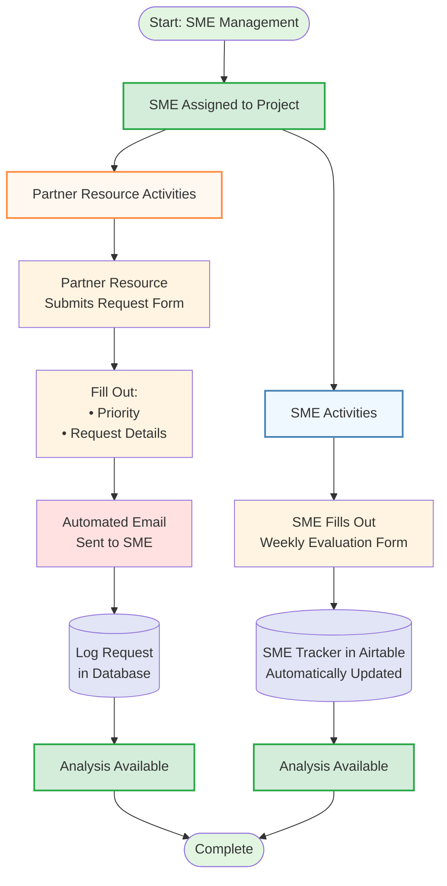

# SME Management Workflow



## Workflow Overview

This diagram illustrates the SME (Subject Matter Expert) management process, showing both weekly SME evaluations and partner resource request handling.

### Key Components:

1. **SME Assignment** - SME is assigned to a project as the starting point
2. **SME Tracker (Airtable)** - Automatically updated database tracking all SME activities
3. **Request Database** - Logs all partner resource requests for tracking
4. **Automated Email System** - Sends notifications to SMEs for incoming requests
5. **Analysis Available** - Both workflows conclude with analysis ready for review

### Two Primary Workflows:

#### SME Weekly Evaluation (Blue Path):
- SME completes weekly evaluation form
- Form data automatically updates SME Tracker in Airtable
- Analysis becomes available for review and reporting

#### Partner Resource Requests (Orange Path):
- Partner resource submits request form
- Priority and request details are captured
- Automated email is sent to assigned SME
- Request is logged in database for tracking
- Analysis becomes available for review

### Benefits:
- **Automated tracking** - Weekly evaluations sync automatically to Airtable
- **Instant notifications** - SMEs receive automated emails immediately
- **Complete audit trail** - Every request is logged with priority
- **Analysis ready** - Both paths provide data for analysis and reporting
```
