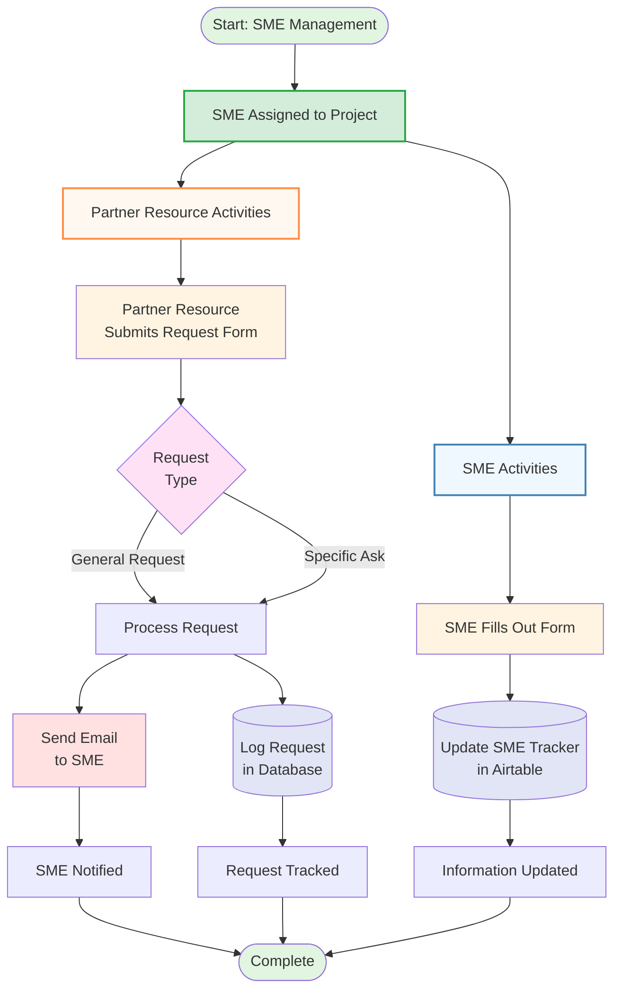

# SME Management Workflow



## Workflow Overview

This diagram illustrates the SME (Subject Matter Expert) management process, showing both SME self-service updates and partner resource request handling.

### Key Components:

1. **SME Assignment** - SME is assigned to a project as the starting point
2. **SME Tracker (Airtable)** - Central database tracking all SME information and activities
3. **Request Database** - Logs all partner resource requests for tracking and analytics
4. **Email Notification System** - Automatically notifies SMEs of incoming requests

### Two Primary Workflows:

#### SME Self-Service (Blue Path):
- SME fills out form with updates
- Information automatically syncs to Airtable SME Tracker
- Keeps SME information current and accessible

#### Partner Resource Requests (Orange Path):
- Partner resource submits request form
- System sends email notification to assigned SME
- Request is logged in database for tracking
- Creates audit trail of all SME interactions

### Benefits:
- **Centralized tracking** - All SME activities in one place
- **Automated notifications** - SMEs receive requests immediately
- **Complete audit trail** - Every request is logged and trackable
- **Self-service updates** - SMEs can update their own information
```
